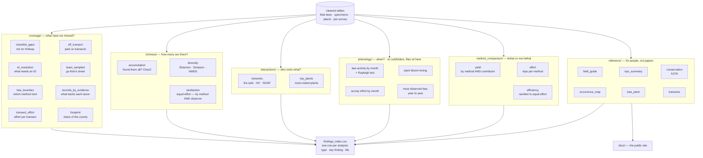

# Analysis

Every analysis, what it produces, and where it lands.

## The flow

Two things the picture cannot show:

- **`richness/rarefaction/` holds the observer comparison**, not `method_comparison/`.
  It is filed by what the analysis *is*, not by what it compares.
- **A `fair_*` subfolder means the output is restricted to one window.** Anything
  outside one is all-records.

## Where to find a figure or a table

Everything lands under `data/analysis/<year>_generated/`. One folder per question:

| Folder | Answers | png | csv |
|---|---|---|---|
| `coverage/bee_bounties` | which bees need which method next | 2 | 3 |
| `coverage/checklist_gaps` | CABR taxa not on the Holway county list | 1 | 3 |
| `coverage/footprint` | the park's share of county diversity | 1 | 3 |
| `coverage/id_resolution` | what needs identifying most | 1 | 2 |
| `coverage/least_sampled` | the go-find-it sheet | — | 2 |
| `coverage/off_transect` | bees in the park but off the transects | 1 | 3 |
| `coverage/records_by_evidence` | what backs each genus and species | 3 | 5 |
| `coverage/transect_effort` | per-transect sampling effort | 2 | 2 |
| `richness/accumulation` | have we found them all? (Chao2) | 3 | 2 |
| `richness/diversity` | Shannon / Simpson / NMDS | 4 | 3 |
| `richness/rarefaction` | richness at equal effort — by method, and by observer | 2 | 6 |
| `interactions/networks` | the plant–bee web, H2′ and NODF | 6 | 10 |
| `interactions/top_plants` | the plants bees visit most | 2 | 3 |
| `phenology/` | activity through the year, survey effort by month | 6 | 10 |
| `method_comparison/yield` | what each **method** turned up, and each **contributor** | 2 | 6 |
| `method_comparison/efficiency` | rarefied to equal effort | — | 1 |
| `method_comparison/effort` | survey trips by method | — | 1 |
| `reference/field_guide` | the species and genus guides | — | 4 |
| `reference/nps_summary` | plain counts, no interpretation | — | 11 |
| `reference/conservation` | IUCN status | 5 | 3 |
| `reference/occurrence_map`, `bee_plant`, `transects` | the interactive pages | 1 | — |

**Start at `findings_index.csv`** in that folder: one row per analysis, with its
type, its key finding in a sentence, and the file holding the numbers. Each folder
also has its own `WHAT_THESE_FILES_ARE.txt`.

**Two comparisons run here, and they are not the same question.** *Method* is lethal
vs non-lethal; *observer* is beeple vs interns. They were confounded before 2024 —
only interns netted, only beeple photographed — so each has its own window below, and the
observer results live under `richness/rarefaction/fair_observer_2024/` rather than in
`method_comparison/`. Read them together: lethal beats non-lethal, but with method
held constant beeple beat interns, so the gap is the netting rather than the people.

Anything under a `website/` subfolder is a draft page; publishing copies it to
`docs/`. Anything under `fair_method_2021_2023/` or `fair_observer_2024/` is
restricted to one of the windows below.

## The three fair windows

| Window | Compares | Controls for | Confounded with |
|---|---|---|---|
| `fair_method_2021_2023` (Mar–Oct) | lethal vs non-lethal | year | **observer** — only interns netted, only beeple photographed |
| `fair_observer_2024` (May–Sep) | beeple vs interns | method, year | *nothing — this is the clean one* |
| *(not built)* interns 2021–23 vs 2024 | lethal vs non-lethal | observer | year |

Read the first two together. Neither means much alone.

## Global conventions

These hold everywhere unless the table below overrides them.

| | |
|---|---|
| **Both ranks, always** | Every diversity / accumulation / interaction result runs at genus *and* species |
| **Scope is stated on every figure** | Never mixed silently. `scope_cap()` prints it. |
| **Method routing** | lethal = specimen table · non-lethal = iNaturalist |
| **Say lethal / non-lethal** | That is how the data is coded (`survey_method`) and how figures are labelled (`BEE_METHOD_LABEL`). Gloss it as "(net)" and "(photo)" on first use in a document, then stay with the coded terms. Do not switch to "specimen vs photo" or "nets vs photos" mid-way — a reader cannot tell whether a new pair of words means a new comparison. |
| **Season window** | Year-to-year comparisons clipped to `WINDOW_MONTHS` |
| **Transects** | BST, UPMON, TP, OT. TP is not oversampled — it is walked in both directions. |
| **Specimen coordinates are transect centroids** | ~980 specimens fall on ~18 points, so a specimen map is misleading |
| **Off-transect specimens are not surveys** | 115 of 980. They count toward park totals, but are excluded from per-survey effort. |
| **Show every genus** | No arbitrary top-N in genus figures |
| **On-transect means within 50 m** | `IBC_OFF_TRANSECT_M`. Casual iNaturalist coordinates drift to hundreds of metres, so a tighter buffer would drop real survey records. 7,440 of 11,396 records resolve to a transect. |

## Master table

| Analysis (script) | Scope | Ranks | Method | Key parameters | Test / null |
|---|---|---|---|---|---|
| Accumulation by effort (`genera_and_species_accumulation.R`) | survey-effort (iNat survey-only + all specimens) | both | pooled per transect | `PERMUTATIONS=200`, unit = one survey per (day×transect), zero-catch kept, `seed=1` | `vegan::specaccum(random)`; Chao2 via `specpool` (± SE, no p) |
| CABR vs Holway (`coverage_cabr_vs_holway.R`) | all-records (evidence recomputed from cleaned tables) | species | pooled | grades each non-Holway taxon by specimen/iNat/research-grade evidence | descriptive |
| Method Venn + resolution (`coverage_method_venn.R`) | **all-records** | both | **method split** | colors per method | **χ²** (resolution × method) |
| Off-transect bees (`coverage_offtransect.R`) | **all-records** | both | pooled | park vs transect assignment | descriptive |
| Yield by group (`coverage_yield_by_method.R`) | **survey-only** | both | **method split** × beeple/intern | per-survey yield | descriptive |
| Target-ID list (`coverage_id_targets.R`) | all-records | species-resolution flag | pooled | **all genera** (no top-N); per-method figs share one A–Z genus set with `drop=FALSE` | descriptive |
| Diversity indices + ordination (`diversity_indices.R`) | **survey-only** | both | pooled | `WINDOW_MONTHS=3:9`, `MIN_SITE_REC=15` | **PERMANOVA** `adonis2` Bray–Curtis + NMDS; Shannon/Simpson/Pielou |
| Top plants (`interactions_top_plants.R`) | 3 disclosed: whole-park (headline), survey-only, method | genus (plant) | split shown | `TOP_N=10`, `TOP_MONTH=12` | descriptive |
| Plant–bee network (`interactions_network.R`) | **all-records** | both | pooled | `SPECIALIST_MAX_PLANTS=2`, `MIN_SHARED=3`, H2′ `nsim=999`, NODF `nsimul=499` | **H2′** vs `r2dtable`; **NODF** vs `oecosimu` quasiswap |
| Per-genus species webs (`interactions_genus_species_webs.R`) | all-records (matches network) | within-genus species | pooled | `MIN_SPECIES`, `MIN_REC` thresholds; `seed=1` | within-genus **H2′** vs `r2dtable` |
| Phenology activity (`phenology_activity.R`) | plants **survey-only**; bees **all-records** | both (bees) | pooled (bees) | drop `flower_flowering=="no"` | **Rayleigh** circular test |
| Effort calendar (`phenology_effort.R`) | survey list | — | shown | `WINDOW_MONTHS=3:9` | descriptive |
| Rarefaction — vegan (`rarefaction_vegan.R`) | **survey-only** | both | 4 comparisons incl. method | `WINDOW_MONTHS=3:9`, rarefy-to-lowest | rarefaction (CIs, no p) |
| Rarefaction — iNEXT (`rarefaction_inext.R`) | **survey-only** | both | incl. obs-vs-specimen | `QVALS=0,1,2` (Hill), `NBOOT=50` | size- & coverage-based Hill numbers |
| Bee Bounties (`bee_bounties.R`) | method-gap (all-records) | both | **method split** | **all gap species (no cap)**, `HALF_WIDTH_M=5` (photo corridor) | descriptive gap lists |
| NPS summary (`nps_summary_tables.R`) | descriptive (all) | species | shown | — | plain counts, no test |

---
