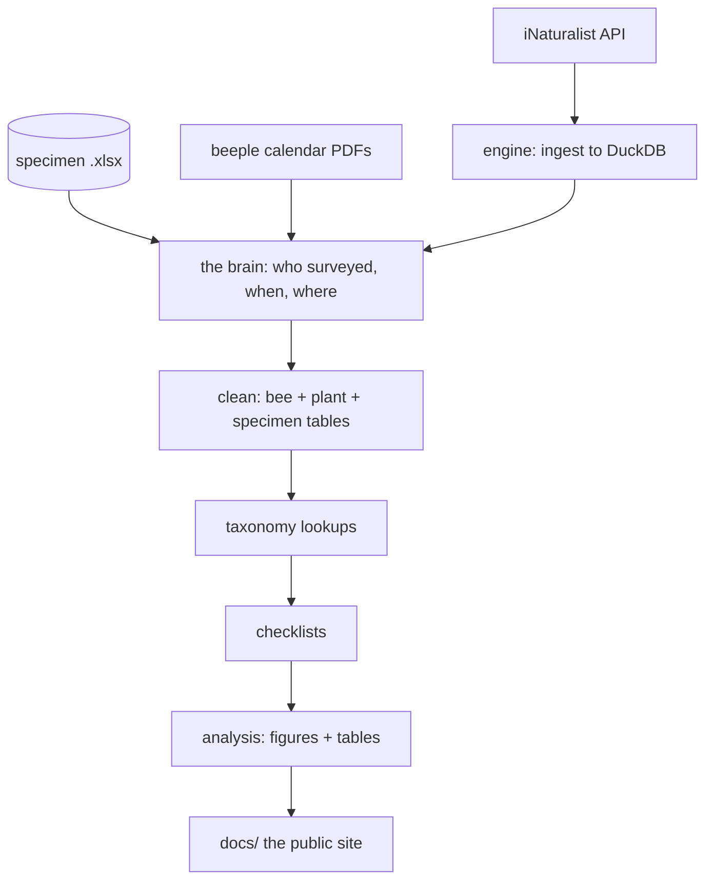

# The pipeline

**Part 1** — running it. **Part 2** — answering what it asks.
**Part 3** — how it works, for anyone changing the code.

---

# Part 1 — Running it

```
config.R                                  loads first, on its own
   |                                      every script sources it; you never run it
   v
1. run_data_cleaning_pipeline.R           ingest + clean       slow, asks questions
   |
   v
2. run_all_analysis_pipeline.R            figures + tables     fast, silent
   |
   v
3. run_publishing_materials_pipeline.R    the public site      fast, silent
```

```r
source("scripts/run_data_cleaning_pipeline.R")
source("scripts/run_all_analysis_pipeline.R")
source("scripts/run_publishing_materials_pipeline.R")
```

**Run them in that order.** Each stage reads what the one before it wrote, and
stage 3 stops rather than publish a page older than the data.

Open `beescabr.Rproj` in RStudio first — that sets the working directory, which
every path assumes.

## First run on a new machine

```r
source("scripts/utils/install_requirements.R")
```

> `sf` and `ggspatial` sometimes need system libraries (GDAL, GEOS, PROJ). If they
> fail to install: [r-spatial.github.io/sf](https://r-spatial.github.io/sf/)

Then two API keys. **They are personal — never use someone else's, and never copy
another person's `data/secrets/`.** A pull runs as whoever signed in, and that
account's trust level decides what comes back.

| Service | Unlocks | Needed? |
|---|---|---|
| **iNaturalist** | true coordinates for sensitive taxa (*Bombus crotchii* etc.) | Strongly recommended |
| **IUCN Red List** | conservation status on the field guides | Optional — column reads "not evaluated" without it |

The pipeline **asks for anything missing on the first run** and offers to save it
to `data/secrets/` (gitignored, readable only by you).

**Setting up iNaturalist, once:**

```
1. Sign in as the account observers already trust  (the park's account)
2. inaturalist.org/oauth/applications/new
3. Name it e.g. officialbeescabr
4. Callback URL:  http://localhost:3000/beescabr
5. Copy the Client ID + Secret -- the pipeline will ask
```

> Coordinate trust is granted by each observer **to a specific account**. It does
> not transfer. A brand-new account gets obscured coordinates until every observer
> trusts it separately, which is not realistic. Use the park account.

The first run opens a browser once to Authorize. Later runs are silent.

## Before you run: the files only a person can update

Full list and rules: `MANUAL_INPUTS.md`.

| What | File | When |
|---|---|---|
| Everyone | `project_info/rosters/people_manual.csv` | anyone new, **before** their first season |
| Intern survey dates | `.../survey_date_sources/master_intern_survey_log_manual.csv` | each intern trip |
| Beeple calendar | `.../beeple_calendar_windows/YYYY Cabrillo Bee Survey Calendar.pdf` | each new season |
| Specimens | `specimens/records/cabr_bee_specimens_record_V{n}_{date}.xlsx` | after netting or a new determination |

**Anything ending `_generated` is written by the pipeline. Never edit it.**

## The three stages

### Stage 1 — clean

Opens with a menu. Choose **1** unless you have a reason not to — or **3** if you
were handed a `data/` folder and just want to see the pipeline run.

| | Mode | When |
|---|---|---|
| 1 | Normal run | the usual: pull only what is new since last time (seconds) |
| 2 | Bees only | normal bee pull, plants skipped — leaves plant data stale |
| 3 | Offline run | no iNaturalist calls at all, reuse what is cached |
| 4 | Full rebuild | re-download everything, ~40+ min, once a year, **needs bee expertise** |

Do not set `BEESCABR_SKIP_INGEST` or the other flags by hand. A flag left set from
an earlier run makes the pipeline skip this menu without saying so, which is the
bug the menu was written to end.

It stops to ask about unknown tags, new taxa and specimen
IDs. Unattended runs skip the prompts.

### Stage 2 — analyse

Runs every script in `scripts/analysis/`, writes into `data/analysis/`. Silent,
a few minutes, no network.

### Stage 3 — publish

Rebuilds the public pages into `docs/`. **Building is not publishing** — commit and
push `docs/` when you are happy with it. See `WEBSITE_GUIDE.md`.

## Where the work lands

```
  data/analysis/<year>_generated/
        findings_index.csv        <-- START HERE: one sentence per analysis
        coverage/  richness/  phenology/  interactions/
        method_comparison/  reference/
  docs/                           <-- the public site
```

Each folder has a `WHAT_THESE_FILES_ARE.txt`.

## Checking your work

```r
library(testthat); test_dir("tests/testthat")
```

Then read `findings_index.csv` — 28 sentences. If one reads wrong, open that
analysis's `_findings.csv`, which sits beside its outputs.

## Starting a new season

| | |
|---|---|
| **Drop in this year's calendar PDF** | the easy one to forget — without it the season has no survey windows |
| **Add anyone new to the roster** | before their first survey |
| **Add intern trips to the log** | as they happen |
| **Save a new specimen version** | after netting or a determination |

**Once a year:** a full re-walk with a bee person present (taxonomy moves), a
reference refresh, and re-read `LIMITATIONS.md`.

## When something breaks

| Symptom | Look at |
|---|---|
| A stage failed but the run continued | the `note:` lines — a stage can fail quietly |
| A number looks wrong | the analysis script, never the output file |
| A path error after moving files | `library(testthat); test_dir("tests/testthat")` catches these |
| Nothing downloads | your API keys, and whether you are signed in as the park account |
| A page did not rebuild | stage 3 now stops on this rather than publishing stale |

---

# Part 2 — Answering the prompts

Stage 1 stops and asks. These are the reference tables for answering.

## Console prompt keys

One consistent set, everywhere.

**Decision gates** — stop, or carry on:

| Key | Does |
|---|---|
| `skip` / `s` / `c` / `go` / `ok` / `y` | continue past, leave it for later |
| `stop` / `x` | halt so you can fix it now |
| *anything else, or bare Enter* | **re-asks** — it never guesses |

**Item-by-item reviewers** (`review_crosswalk`, `review_windows`, transect ties):

| Key | Does |
|---|---|
| `<Enter>` | accept the highlighted `*` suggestion |
| `s` | skip this item — it returns next run |
| `q` | save everything and quit |
| `?` | show the keys again |

Each reviewer adds its own keys on top:

| Reviewer | Extra keys |
|---|---|
| Unknown tags / fields | `i` file it as **ignore** (keep the observation, skip the field) · `n` name a new concept |
| Survey windows | `y` / `n` · `u` unsure · `l` list the URLs |
| Transect ties | `b` (or `both`) — a genuine two-transect day, kept as such · `u` unsure |
| New-taxon verification | `y` verify · `r` reject-for-now · the prompt explains itself in full |

An answer the reviewer does not recognise is **re-asked**, never guessed.

**Heads-up prompts** have nothing to decide: any key continues.

## Unknown tags and fields

The clean scripts triage every observation against the crosswalk.

### Unknown tags → normal, mostly harmless

Camera and lens tags (`D500`, `300mm f/4`), species names, place names. Written to
`qc/cabr_inat_bee_unknown_tags.csv`.

**This list will not trend to zero, and should not.** Skim it for a real project
tag that was mistyped; ignore the rest.

### Unknown fields → ACTION NEEDED

Structured key-value fields, which *do* need a decision:

```
1. Look the field up on iNat, by id or name
2. Add a row to the crosswalk:
       relevant      ->  type = obs_field
       not relevant  ->  type = ignore
3. Re-run -- it disappears from the block
```

## The crosswalk

`data/project_info/crosswalk/master_crosswalk_manual.csv` controls `inat_bee_clean.R` and `inat_plant_clean.R`. Adding or editing rows changes script behavior without touching any R code.

### Column reference

| Column | What it holds |
|--------|---------------|
| `name` | Human-readable tag or field name |
| `field_id` | iNat observation field ID(s); blank for tags and derived fields |
| `category` | Grouping label (Transect, Beeple, Intern, Exclude, Field, Timing-Weather, Derived, Location) |
| `type` | Controls how the script handles this row — see Type values below |
| `datatype` | Expected value type: `text`, `taxon`, `numeric`, `time` |
| `allowed_values` | Pipe-separated valid values; `"fill in"` = auto-fetch from iNat API on next run |
| `applies_to` | Which export this row applies to: `bee`, `plant`, `both`, or `exclude` |
| `method_context` | Survey method(s): `non-lethal`, `lethal`, `both`, or `n/a` |
| `current_location` | Where the script looks for this value: `tag_list`, `obs_field`, `description (notes)`, `tag_list (photo-metadata tags)` |
| `inat_variants` | Known alternate spellings/capitalizations in raw iNat data |
| `specimen_plot_variants` | How this tag/field appears in physical plot or specimen sheets |
| `verified` | `TRUE` = confirmed against real data; `FALSE` = added but not yet spot-checked |
| `notes` | What this tag/field means and when to use it |
| `script_rules` | Logic the script applies beyond allowed_values (normalization, derivation heuristics, overrides) |

### Type values

| type | Meaning |
|------|---------|
| `tag` | iNat observation tag (free-text label). Script looks in `tag_list`. |
| `obs_field` | iNat observation field (structured key-value). Script looks in `ofvs` from the API. |
| `notes_field` | Value extracted from the free-text description/notes field. |
| `derived` | Computed by the script from other data; not directly from iNat. |
| `ignore` | **Field exists in iNat data but is not processed. The observation is kept — only this field is skipped.** Use for survey-irrelevant fields (e.g. `Fasciation`, `Leaf aroma`). |
| `exclude` | **Tag marks an entire observation to be dropped.** The observation is removed, not just the field. Use for non-Cabrillo projects swept in by the SD County pull, or pilot data excluded by the PI. |

`ignore` and `exclude` are deliberately different: `ignore` = keep the obs, skip the field; `exclude` = drop the obs entirely.

---

## Complex ranks

iNaturalist uses **Complex** for cryptic species groups that can't be distinguished from photos (e.g. *Andrena osmioides*, *Diadasia australis*).

- Each taxon has `complex` (complex name) and `complex_taxon_id` columns in the checklist.
- Complexes are not excluded from richness counts — each unique `taxon_id` counts as one taxon.
- `complex` is the join key for matching iNat photo observations against museum specimens. Exact `taxon_id` match is preferred; complex-level matches are flagged separately.
- In Tier 2 / Holway-format outputs, `Complex` values are prefixed `"(Complex) "` (e.g. `"(Complex) Diadasia australis"`) so they aren't misread as confirmed species binomials.

---

# Part 3 — How it works

## The flow



Three things that shape hold:

- the API is pulled **once**, straight into DuckDB — no R-side JSON parse;
- taxa are resolved in batches of 30, throttled;
- **the brain decides who surveyed, when and where exactly once.** Every clean
  script then looks that answer up by `obs_id` rather than working it out again.

## Stage by stage

| # | Stage | Script | Writes |
|---|---|---|---|
| 1–2 | Ingest | `inat_observations/engine/**` | the DuckDB cache |
| 2b | Plants | `engine/pipelines/ingest_plants.R` | plant cache |
| 2c | Field map | `inat_observations/build_field_id_map.R` | `inat_field_id_map_generated.csv` |
| 2d | Calendars | `project_info/surveys/finding_beeple_calendar.R` | `beeple_calendar_windows_generated.csv` |
| 3 | **The brain** | `project_info/finding_project_info.R` | `master_per_survey_info_generated.csv` + review queues |
| 3b | Review *(interactive)* | `project_info/review/*` | updates the crosswalk |
| 4 | Clean | `inat_observations/clean/*`, `specimens/specimen_bee_clean.R` | the `*_clean_generated.csv` tables |
| 5 | Taxonomy | `reference/taxonomy/*` | `sd_bee_taxonomy_lookup_generated.csv` |
| 6 | Checklists | `checklists/*` | `data/checklists/**` |

| Design rule | Why |
|---|---|
| **One fetch entrypoint** | Only `engine/pipelines/ingest_inat.R` calls the observations API. One place to reason about rate limits. |
| **Layers point downward** | `config.R` → `db/` → `api/` → `pipelines/` → `checklists/` & `clean/`. Never upward. |
| **Constants live in `config.R`** | No script hardcodes a path. |
| **Membership logic lives in the brain** | It used to be spread through the clean scripts. Now they just look up an answer. |
| **Source guards** | `if (!exists("sym")) source(...)` so a file can be sourced alone or by the runner. |

## Where things live

Folder layout: `scripts/WHAT_THESE_FILES_ARE.txt` and the note in each folder.
Running it: Part 1.

**A normal run is offline.** IUCN status and plant common names come from a cache;
anything a year old is refreshed automatically. Forcing a live re-check is a recovery
hatch, not a run mode — see the flags in the header of
`scripts/run_data_cleaning_pipeline.R`.

## Adding or changing a module

**Test first — always.** `CLAUDE.md` has the rule; the short version:

```
1. Write the test          tests/testthat/test-<module>.R
2. Run it, watch it FAIL   a test that passes before the code is not testing anything
3. Write the minimum       to make it pass
4. Run the whole suite     library(testthat); test_dir("tests/testthat")
```

| Testing what | How |
|---|---|
| Pure logic | in-memory fixtures |
| Network code | inject a fake through `request_fn` — **never** hit the real API |
| DuckDB | a temp database — **never** the real cache |

## The iNaturalist API

**API versions this pipeline depends on** (constants live in `scripts/config.R`):

| Service | Version | How we reach it | Notes |
| --- | --- | --- | --- |
| iNaturalist | **v1** | direct HTTP, `https://api.inaturalist.org/v1/` | observations, taxa, observation fields. iNat also has a v2 we deliberately do **not** use — moving would change response shapes and needs a planned migration. |
| IUCN Red List | **v4** | the `rredlist` R package (1.1.1) | needs a free token in `data/secrets/iucn_api.env` or `IUCN_REDLIST_KEY`. Every cached status records its API version in the `source` column of `iucn_status_generated.csv`. |


Two scripts pull from the API rather than the CSV export:

- `scripts/inat_observations/clean/inat_bee_clean.R` — fetches survey observations, tags, and observation fields via `/v1/observations`.
- `scripts/reference/taxonomy/taxonomy_lookup_build.R` — per-taxon taxonomy/ancestry lookups (~400 calls, ~3–4 min), via the v1 taxa endpoints.

**Endpoint:** `https://api.inaturalist.org/v1/observations`. Read-only; no authentication required. Max `per_page = 200`; `inat_bee_clean.R` pages with an `id_above` cursor. Rate limit: ~1 request/second; scripts include `Sys.sleep(1)`.

**Why the API and not the export:** iNat's CSV export only includes observation fields the *exporter* has personally used — fields attached by other observers are invisible. The API returns every field on every observation (`ofvs`), which is what the crosswalk triage requires.

**Why v1:** v1 is what iNaturalist's own site and apps run on — it is the most stable choice. v2 exists but has returned incomplete results on some queries. iNat's deprecated version is v0 (Rails), not v1.

**If v1 is retired:** swap `/v1/` → `/v2/` and add a `fields` parameter (v2 returns minimal data by default; v1 returns everything). Watch iNaturalist's forum (News & Updates) for any sunset notice.

---

## Working with Claude here

The rules live in `CLAUDE.md` and Claude reads them itself. What helps most in a
request:

- **Name the module and its test file** — "in `inat_flatten.R`, tests in
  `test-flatten.R`" beats "add X somewhere".
- **Point at the layer** — "this is transport, so `inat_http.R`, not the ingest loop".
- **Say inject a fake** for anything touching the API or DuckDB.

Example: *"Add an `updated_since` incremental mode to `ingest_inat.R`. Test-first in
`test-db.R` with an injected fake `request_text_fn`; confirm red, then implement,
then run the full suite."*
