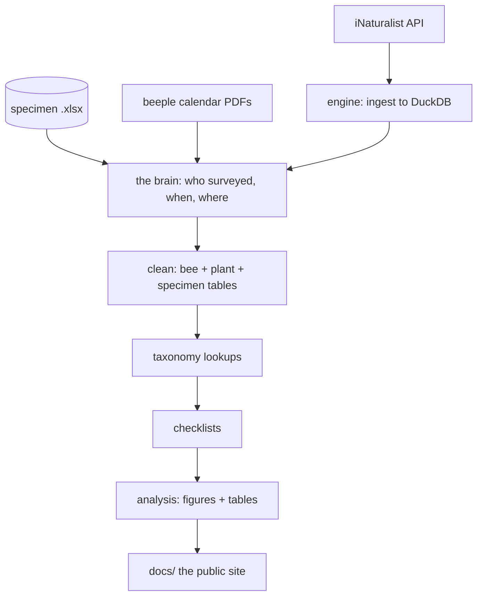

# Scripts

Folder layout lives in `scripts/WHAT_THESE_FILES_ARE.txt`, beside the code.
This page is the **stage → script → output** map.

## The flow

## Stage by stage

| # | Stage | Script | Writes |
|---|---|---|---|
| 1–2 | Ingest | `inat_observations/engine/**` | the DuckDB cache |
| 2b | Plants | `engine/pipelines/ingest_plants.R` | plant cache |
| 2c | Field map | `inat_observations/build_field_id_map.R` | `inat_field_id_map_generated.csv` |
| 2d | Calendars | `project_info/surveys/finding_beeple_calendar.R` | `beeple_calendar_windows_generated.csv` |
| 3 | **The brain** | `project_info/finding_project_info.R` | `master_per_survey_info_generated.csv` + review queues |
| 3b | Review *(interactive)* | `project_info/review/*` | updates the crosswalk |
| 4 | Clean | `inat_observations/clean/*`, `specimens/specimen_bee_clean.R` | the `*_clean_generated.csv` tables |
| 5 | Taxonomy | `reference/taxonomy/*` | `sd_bee_taxonomy_lookup_generated.csv` |
| 6 | Checklists | `checklists/*` | `data/checklists/**` |

## Three things to know

| | |
|---|---|
| **`config.R` owns every path** | Scripts inherit paths; they don't build their own. |
| **A normal run is offline** | IUCN status and plant names come from a cache. |
| **To force a live refresh** | `Sys.setenv(BEESCABR_REFRESH = "1")` before the cleaning pipeline. Needs internet + an IUCN token. |
