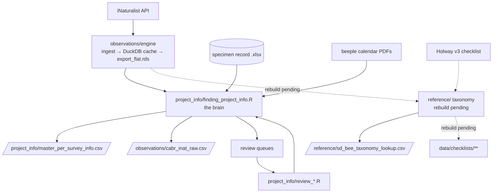

# `scripts/` — the beescabr pipeline

Compares **lethal** (specimen) vs **non-lethal** (iNaturalist) bee surveys at Cabrillo
National Monument (CABR). One command runs everything:

```r
Rscript scripts/run_data_cleaning_pipeline.R      # or Source in RStudio
```

`run_data_cleaning_pipeline.R` is the single entrypoint; `config.R` holds every constant and data
path. Each folder below **mirrors a domain in `data/`** and owns the scripts that
produce that domain's outputs.

A normal run stays **fully offline** (IUCN status + plant common names are baked into the
cleaned tables from a cache). To force a live re-check of both against their APIs, run with
the refresh flag:

```r
BEESCABR_REFRESH=1 Rscript scripts/run_data_cleaning_pipeline.R   # ONLINE: re-checks IUCN + plant names, then re-bakes
```

This runs `reference/refresh_iucn_status.R` + `reference/refresh_plant_common_names.R` as an
optional online pre-step (needs internet + an IUCN token); off by default. They can also be run
on their own from `scripts/reference/`.

## Folder map

| `scripts/` folder | mirrors `data/` | what lives here |
|---|---|---|
| `observations/` | `data/observations/` | the iNat ingest **engine**, per-obs cleaning/QC, and `build_field_id_map.R` (pipeline stage 2c) |
| `observations/engine/` | `data/observations/cache/` | shared machine: `api/` (HTTP, flatten, cache), `db/` (DuckDB stores), `pipelines/` (ingest + export) |
| `project_info/` | `data/project_info/` | the "brain" (survey membership), survey record, calendar parsing, interactive review |
| `specimens/` | `data/specimens/` | specimen-record cleaning |
| `reference/` | `data/reference/` | `holway.R`, `holway_reference_build.R` (interactive Holway→iNat resolver, with parent **roll-up** — complex→subgenus→genus), `taxonomy_reference.R`, `verify.R`, `taxonomy_lookup_build.R` (builds `sd_bee_taxonomy_lookup.csv`), `enrich_lookups.R`, plant/taxonomy lookup builders, **plus the online refresh tools `refresh_iucn_status.R` + `refresh_plant_common_names.R`** (run via `BEESCABR_REFRESH=1`, or standalone) |
| `checklists/` | `data/checklists/` | shared helper `checklist_build.R`, plus **rough-draft** region builders `cabr_bee_checklist.R`, `pl_bee_checklist.R`, `sd_bee_checklist.R` (not sourced until built) |
| `spatial/` | `data/spatial/` | `spatial_utils.R` — loads/reprojects boundary + transect layers and applies buffers (in-memory; never written) |
| `analysis/` | — | `native_bee_data_analysis.Rmd` — downstream analysis/report notebook (run by hand) |
| `utils/` | — | tiny shared helpers (`read_latest`, `write_fresh`, …) |

## Pipeline stages → scripts → data outputs

The runner sources modules in this order and calls them from `main()`:

| # | Stage | Scripts (folder) | Produces in `data/` |
|---|---|---|---|
| 1–2 | **Ingest + export** | `observations/engine/**` | `observations/cache/inat_cache.duckdb`, `export_flat.rds` |
| 2b | **Plants** | `observations/engine/pipelines/ingest_plants.R` | `observations/cache/export_flat_plant.rds` |
| 2c | **Field map** | `observations/build_field_id_map.R` | `observations/reference/inat_field_id_map.csv` |
| 2d | **Beeple calendars** | `project_info/finding_beeple_calendar.R` | `project_info/survey_date_sources/beeple_calendar_windows/beeple_calendar_windows.csv` |
| 3 | **Brain** (membership, provenance, survey record) | `project_info/finding_project_info.R` → sources `project_info/resolve_beeple_transects_per_survey.R`, `project_info/finding_survey_dates.R`, `project_info/finding_specimen_dates.R` | `observations/cabr_inat_raw.csv`, `project_info/master_per_survey_info.csv`, the review queues |
| 3b–3e | **Review** (interactive) | `project_info/review_crosswalk.R`, `project_info/review_windows.R` (+ optional y/N notes review → `project_info/review_notes.R`) | updates `project_info/master_crosswalk.csv` + `*/review/*` |
| 4 | **Clean** | `observations/inat_bee_clean.R` (live) · `specimens/specimen_bee_clean.R` (stub) | `observations/inat_clean/cabr_inat_bee_clean.csv` (bee; plant + specimen pending) |
| 5 | **Reference / taxonomy** (restored) | `reference/taxonomy_lookup_build.R` → `build_taxonomy_lookup()` (non-interactive, wired here). The interactive `reference/holway_reference_build.R` (Holway→iNat resolver, **parent roll-up**) is run **by hand**; helpers `holway.R`, `taxonomy_reference.R`, `verify.R` load via its `need()` block | `reference/holway_sd_bee_reference_table_v3.csv` (by hand), `reference/sd_bee_taxonomy_lookup.csv` |
| 5+ | **Checklists** *(rough drafts — run LAST, not sourced yet)* | `checklists/cabr_bee_checklist.R`, `pl_bee_checklist.R`, `sd_bee_checklist.R` on shared helper `checklist_build.R` | (pending) `data/checklists/{cabr,point_loma,sd_county}/…_native_bee_checklist.csv` |



## Notes for the next maintainer

- **`config.R`** owns every data path (the `PATHS` list + cache constants). Most engine
  and reference scripts do no file I/O of their own — they inherit paths from here.
- **`need()` / `src()`** helpers resolve script paths relative to the **repo root**
  (`file.path("scripts", rel)`), so scripts run from the repo root regardless of folder.
- **`observations/inat_bee_clean.R`** (stage 4, live): reads the brain's `cabr_inat_raw.csv`,
  joins coords + `taxon_id` from the export, writes `cabr_inat_bee_clean.csv` (one labeled CABR
  bee table; taxonomy columns are blank until the lookup rebuild). It also uses the transect +
  `access_routes_to_transects/cabr_survey_access_routes.shp` (Humphreys Rd) layers to re-mark
  **walk-in** obs — tagged but off every transect and on the access road — as `is_survey = FALSE`
  (see `survey_note`). The pin-map that visualises this lives with the road layer as a reference,
  not in the pipeline. `specimens/specimen_bee_clean.R` is still a stub.
- **No run-by-hand pipeline scripts.** `build_field_id_map.R` is now a pipeline step (stage 2c,
  in `observations/`); `build_plant_export.R` was retired (its job is stage 2b); `PITFALLS.txt`
  moved to `docs/`. `review_notes.R` (in `project_info/`) is optional — offered as a y/N
  prompt in stage 3b, sourced only if you opt in. The calendar parser
  `project_info/finding_beeple_calendar.R` is now **stage 2d** — it rebuilds the beeple
  window table from the PDFs every run, so a new calendar year is picked up automatically.
- **Removed** (deleted from the repo): `triage.R` (dead), `legacy_checklists.R` (old writer),
  `tier2_merge.R` (`build_specimen_checklist` moved into `checklist_build.R`), `build_plant_export.R`
  (redundant with pipeline stage 2b), `smoke_run.R` (stale), `qc_misplaced_transect.R` (unused —
  its misplaced/mistagged-obs QC is now a TODO in the clean scripts); and the spatial diagnostics
  `check_boundaries.R`, `diagnose_sd_county_gap.R`, `plot_boundaries_individually.R` (one-time boundary
  checks — SD-county gap resolved by the buffer). `tier2_merge.R` stays retired, but its
  `specimen_species_table()` is a **pending restore** — needed for `in_cabr_specimens` in the taxonomy
  lookup + the CABR checklists once `specimen_bee_clean.R` is built.
- **Reference / taxonomy restored (2026-07-20)**: the 5 `reference/` scripts are back in `scripts/reference/`.
  `holway_reference_build.R` gained the **parent roll-up** — an unresolved Holway species inherits its
  nearest on-iNat parent's `taxon_id` + ancestry (same-named complex → subgenus → genus; the complex is
  prompted). Config paths corrected to the reorganized `data/reference/` layout.
